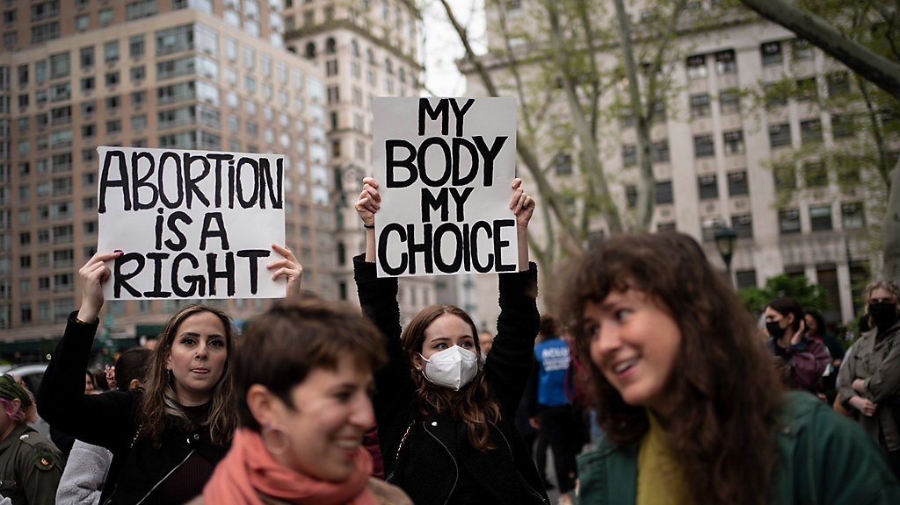

&nbsp; 

Source: [AP Photo/Wong Maye-E](https://www.ny1.com/nyc/all-boroughs/news/2022/05/12/how-new-york-is-preparing-for-a-potential-dismantling-of-roe-v--wade)

&nbsp; 

### Introduction 

The goal of our project is to explore the trends in abortion rates in New York City over time (2017-2020). 

### Screencast

### Motivation 

In 2019, many conservative states raced to enact an unprecedented wave on bans on abortions that have severely restricted women’s reproductive rights. These restrictions have culminated with the recent Supreme Court overturning of Roe v. Wade, a landmark supreme court case granting a women’s right to an abortion. 

Since then, access to abortion has been significantly compromised and even banned in several states across the country. Those that are likely to be most impacted by this decision are individuals that belong to underserved and marginalized communities. Changes in policies could potentially lead to a variation in abortion trends in the country over time.  

We want to explore these trends to understand the implications of policy change in the country concerning reproductive rights. Our year of interest is 2019, which is the most recent dataset provided by New York State. We will be focusing on the numbers of induced abortions in New York City, specifically, and compare the differences across the boroughs. 

### Website Overview

#### Exploratory Analysis

- The exploratory analysis is split into three sections: 
  - [New York State](ny_exploratory_analysis.html) exploratory analysis
  - [New York City](nyc_exploratory_analysis.html) exploratory analysis 
  - [Comparative](comparative.html) exploratory analysis 
- In each of these sections you will be able to see the trends abortion rates within these regions, both overall, as well as stratified by age, race/ethnicty and financial plan used.

#### Statistical Analysis 

- Much like the exploratory analysis, the statistical analysis is also split into three sections: 
  - [New York State](nys_statistical_analysis.html) statistical analysis
  - [New York City](nyc_statistical_analysis.html) statistical analysis 
  - [Comparative](comparative_statistical_analysis.html.html) statistical analysis 
  
- We perform statistical tests such a the proportion t-test and chi-square tests, to test whether there are significant differences in abortion trends between boroughs, counties and across categories of the covariates. 

#### Dashboard 

We created an interactive [Dashboard](https://kasturi-b.shinyapps.io/shiny_dashboard_template/) which has a map that displays the total rates of abortion for counties in New York State. You can observe how the rates change over time (2014-2019). Further, the dashboard also has two barplots that show the the distribution of abortion rates for each county by race/ethnicity and age. 

You can also take a look at our [project report](report.html) for more details on our project! 

&nbsp; 

&nbsp; 

&nbsp; 

***

 
 Kasturi Bhamidipati | Elaine Chen | Ayako Sekiya | Maisie Sun | Daisy Yan 

***

 