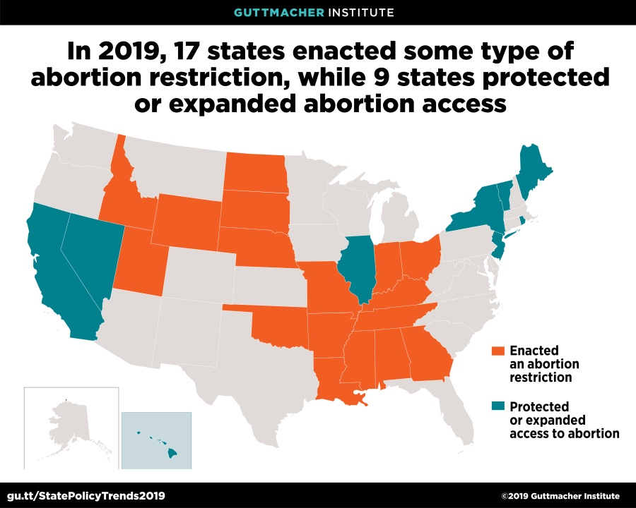

# Motivation


In 2019, many conservative states raced to enact an unprecedented wave on bans on abortions that have severely restricted women’s reproductive rights. These restrictions have culminated with the recent Supreme Court overturning of Roe v. Wade, a landmark supreme court case granting a women’s right to an abortion. 



Source: [Guttmacher Institute](https://www.guttmacher.org/article/2019/12/state-policy-trends-2019-wave-abortion-bans-some-states-are-fighting-back)

Since then, access to abortion has been significantly compromised and even banned in several states across the country. Those that are likely to be most impacted by this decision are individuals that belong to under-served and marginalized communities. Changes in policies could potentially lead to a variation in abortion trends in the country over time.  We want to explore these trends to understand the implications of policy change in the country concerning reproductive rights. 

Our year of interest is 2019, which is the most recent dataset provided by New York State. We will be focusing on the numbers of induced abortions in New York City, specifically, and compare the differences across the boroughs. 


# Additional Resources/ Related Work

Reproductive rights are basic human rights, and women should be allowed to have full autonomy on decisions regarding their bodies. They should be allowed to make decisions freely and responsibly and exercise their rights. Reproductive justice goes far beyond the right to abortion; the issue is inextricably bound to discrimination and inequality. As residents of New York City, we wanted to analyze the trends in abortion, and how it might be affected by factors such as race/ethnicity, financial plan status and age. 

Here's some recent information on abortion clinics/ laws/ and facts:

- In New York City, call the NYC Abortion Access Hub at [1-877-NYC-AHUB](tel:18776922482) or [1-877-692-2482](tel:18776922482)

- [AbortionFinder.org](https://www.abortionfinder.org/)

- [Planned Parenthood](https://www.plannedparenthood.org/abortion-access)

- [after Roe Fell: Abortion Laws by State](https://reproductiverights.org/maps/abortion-laws-by-state/)

- [Guttmacher Institute](https://www.guttmacher.org/state-policy/explore/overview-abortion-laws)

- [What's Next for Abortion Rights in New York?](https://www.nytimes.com/2022/07/08/nyregion/abortion-new-york-roe.html)

- [National Network of Abortion Funds](https://abortionfunds.org/) 

- [Abortion Reporting: New York City (2019)](https://lozierinstitute.org/abortion-reporting-new-york-city-2019/)

# Initial questions

Originally, we wanted to conduct a comparative analysis of abortion rates in New York and Mississippi from 2017-2020 with the following questions:

* Have abortion rates changed over time (2017 to 2020)?
* What does the distribution of abortion rates between counties within New York and Mississippi look like?
* Are abortion rates different in New York compared to Mississippi while accounting for age, race/ethnicity, method, and insurance plan?

We were unable to find a comprehensive dataset that included every factor we were looking for, and decided to focus on conducting an analysis of abortion numbers between boroughs in New York City in 2019. As a result we have developed new research questions as listed as following for our project:


## Final Research Questions:


* What does the distribution of abortion between boroughs within New York City look like in 2019?
  * Are abortion rates different in New York City while accounting for age, race/ethnicity, method, and insurance plan in 2019?
* How do abortion rates differ between New York City and New York State in 2019?
* How do abortion rates differ within regions of New York State in 2019?
  * Are abortion rates different in New York City while accounting for age, race/ethnicity, method, and insurance plan?

# Data


## Source

For this project, we will use data from [Vital Statistics of New York State 2014-2019](https://www.health.ny.gov/statistics/vital_statistics/) (Individual data sets) which consists of group-level data from New York City and New York State. 

- The data wered collected from the New York State Bureau of Vital Records who maintains a registry of all births, marriages, divorces/dissolutions of marriage, deaths, induced termination of pregnancy/abortions, and fetal deaths that have occurred in New York State. 

- The [New York City Department of Health and Mental Hygiene](https://www.health.ny.gov/health_care/medicaid/redesign/ehr/registry/nycdohmh.htm) sends data on on live births, deaths, fetal deaths, induced terminations of pregnancy/abortions (abortion), marriages, and divorces/dissolutions of marriage recorded in New York City to the New York State Department of Health. 

- The New York State Department of Health receives data on live births and deaths recorded outside of New York State to residents of New York State from other states and Canada.

- The two regions are categorized as follows:

  - New York City includes five counties: Bronx, Kings (Brooklyn), New York (Manhattan), Queens and Richmond (Staten Island). 

  - New York State outside of New York City, which encompasses the remaining 57 counties.

From the Vital Statistics of New York State 2019, we will use data from the *Induced Abortions* section, and will specifically focus on data collected from New York City. 

## Data Scraping and Cleaning 

We first imported the datasets from the internet and then cleaned each dataset individually. For each dataset, we selected the variables that were the most relevant and appropriate in exploring our research question. 

We renamed variable names for the different counties in New York City to the name of the boroughs. Final variable names in our dataset for the boroughs include:

- `Manhattan`
- `Bronx`
- `Brooklyn`
- `Queens`
- `Staten Island` 

Data on New York State were obtained from the same dataset, and counties were recoded into regions based on categories set by New York State using `transform`. Some counties had very few abortion numbers, which would not provide a sufficient sample size when adjusting the model for covariates. As a result, the categories helped ensure a sufficient sample size. 

The final regions included in the dataset for New York State includes:

- `Central New York`
- `Eastern Adirondacks`
- `Western Adirondacks`
- `Saratoga`
- `Finger Lakes`
- `Western New York`
- `Hudson Valley`
- `Westchester/Rockland`
- `Long Island`
- `New York City`

The regions were created based on this [website](https://statejobs.ny.gov/assets/help/regionMapText.cfm)

Abortion rates were calculated for regions within NY State, while for NYC they were already available as rates. Rates were calculated by using the following formula: 
$$Abortion\ Rate\ per\ 1000\ Live\ Births\ = \frac{Count}{Number\ of\ Live\ Births} \times 1000$$ 
Specific data cleaning processes for the covariates are listed below.

#### Age

Age was categorized as follows:

- `age_less_20`
- `age_20_24`
- `age_25_29`
- `age_30_34`
- `age_35_39`
- `age_plus_40`

```{r}
# insert table??
```


#### Race/Ethnicity

Race/Ethnicity was broken down into the following categories:

- `Non-Hispanic White`
- `Non-Hispanic Black` 

Ethnicity is distinguished from race and is based on the ethnicity of the mother. Ethnicity distinguishes individuals of Spanish origin regardless of race. Race was self-reported. 
 
#### Financial Plan Status

The final variable names include:

- `Medicaid`
- `Other_insurance`
- `self_pay`
- `not stated`

The technical notes in the dataset did not specify which plans were included under the `other_insurance` category. 

After individual datasets were tidied, they were merged into a final dataset which was then saved and exported to our project repository. These steps were necessary to ensure that the code was readable and reproducible. 


# Exploratory analysis

Our exploratory analysis was split into two categories - [New York State](ny_exploratory_analysis.html) and [New York City](nyc_exploratory_analysis.html). We analyzed how abortion rates may have different across different categories of our covariates (Age, Race/Ethnicity and Financial Plan Status), using plots. 

## NYC Analysis Results:


#### Age:

- The highest rates was found in Manhattan among those who are less than 20 years old with a rate of 1964.9 induced abortions per 1000 live births. 

- The second highest rate is was found among those less than 20 year old in Queens with a rate of 1780.1 induced abortions per 1000 live births. 

- **Overall, the rate of abortions seem to decrease with age. Across the age categories, it appears that Staten Island, New York State, and Brooklyn seemed to have lower abortion rates. **

#### Finance:

- The highest rates were found in Manhattan among those with "Other insurance" with a rate of 62.86k induced abortions per 1000 live births. 

- **The rates were highest among those with "Other insurance" and second highest among those with "self_pay." Rates were lowest among those with Medicaid. **

#### Race:

- Non-Hispanic Individuals: 

  - The highest rates were found in the Bronx among those who identify as Non-Hispanic-Black Only with a rate of 1228.3 induced abortions per 1000 live births. 
  - The lowest rate was found among Non-Hispanic White Only individuals in Brooklyn with a rate of 88.6 induced abortions per 1000 live births. 
  - **The rates were highest among those who were Non-Hispanic-Black Only.** 

- Hispanic Individuals: 

  - The highest rates were found in the Bronx among those who are Hispanic-Black Only with a rate of 684.6 induced abortions per 1000 live births. 
  - The lowest rate was found among Hispanic White-Only in Queens with a rate of 80.4 induced abortions per 1000 live births. 
  - **The rates were generally higher among those who were Hispanic-Black Only in comparison to those who were Hispanic White-Only. **

#### Year:

- From the plot, it is evident that **rates are generally decreasing from 2014-2019.** 

It is important to note that Staten Island had a noticeable increase and decrease of rates in 2016. This is likely due to an external factor, like a policy change. However, Staten Island had the lowest rates for most years in relation to the other boroughs overall. Bronx had the highest rates between 2014-2019. 

## NY State Analysis Results 


# Statistical Analysis


If you undertake formal statistical analyses, describe these in detail

# Limiations 

There were a couple of limitations in our project including the amount of limited abortion data in some of the counties. For the race dataset specifically, some of the data was noted as suppressed due to confidentiality. As a result, we had to omit Eastern and Western Adirondacks from our statistical analysis, despite the possibility that there might be valuable information in these regions. Similarly, for the financial plan dataset, there were some plans that had very small cell counts. The plans with small cell counts were eventually omitted as they were not included in the live birth data set, the denominator to calculate abortion rates. As a result, the statistical analysis for financial plan may not show the full scale of the differences between the plans. 

# Discussion


What were your findings? Are they what you expect? What insights into the data can you make?

