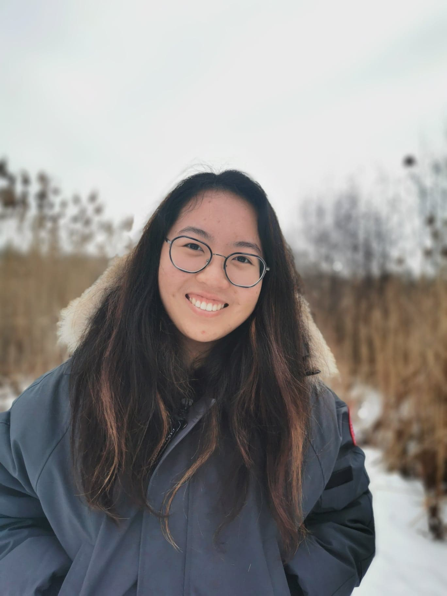
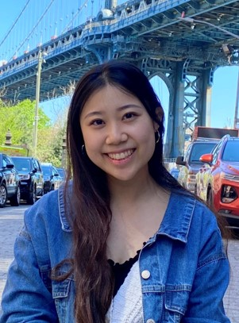
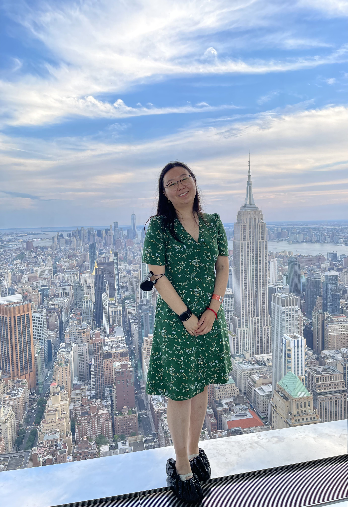
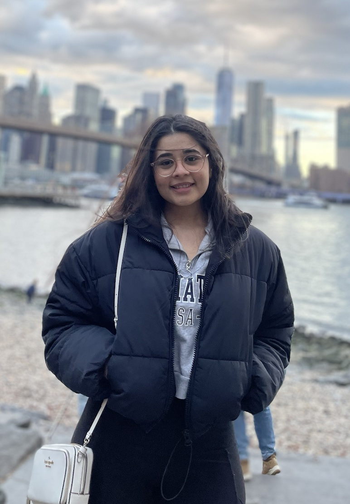

# Members

We are all second year Masters of Public Health (MPH) students at Columbia University Mailman School of Public Health in the Department of Epidemiology.

** Add descriptions for yourselves**
- have link to email and your own githubs too! 

### Maisie Sun 

### Ayako Sekiya 

Ayako is an Epidemiology student with a focus on Applied Biostatistics and Public Health Data Science. Born and raised in the DMV area (not the location where you get your license renewed but the DC metro area). Ayako is interested in applying her epidemiological and statistical programming skills in the pharmaceutical industry, and maybe one day doing public health work in Japan! In her free time she loves to bake, explore different restaurants in NYC, and watch Grey's Anatomy/ GBBO!

### Elaine Yanxi Chen 

Elaine was born and raised in Beijing, China and moved to Vancouver, Canada in high school. She is passionate about biostatistics and public health data science and some of her research area of interest includes genetic and cancer epidemiology. Outside of school, Elaine loves to read, play the piano, go swimming, or watch lots of (not American) football.

Here is her [Github](https://github.com/ElaineYanxi-Chen) if you want to look at some of her other projects and feel free to connect with her over email at yc4017@cumc.columbia.edu or over [LinkedIn](https://www.linkedin.com/in/elaine-chen-62a94516a/).

### Daisy Yan 

### Kasturi Bhamidipati 

Kasturi is an Epidemiology student with a focus on Chronic Disease Epidemiology. She was born and raised in Bangalore, India and moved to the US for gradschool. Kasturi is passionate about making public health and healthcare services more equitable and accessible, using data and research to support decision-making. In her free time, she loves to explore new places to eat, have picnics in Central Park and hangout with her friends!

