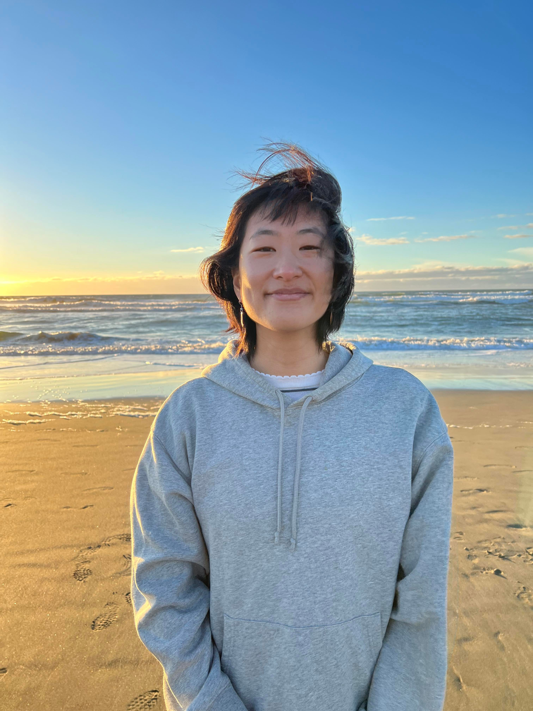

We are all second year Masters of Public Health (MPH) students at Columbia University Mailman School of Public Health in the Department of Epidemiology.

## Maisie Sun 

 

Maisie is an Epidemiology student with a focus on Applied Biostatistics and Public Health Data Science. Born in China and raised in Canada. Maisie is interested in applying her data science and biostatistics knowledge in telling stories through data. In her free time, she loves badminton, hiking, drawing, and watching cdramas.

Here is her [Github](https://github.com/Maisie66) if you want to look at some of her other projects and feel free to connect with her over email at ms6360@cumc.columbia.edu or over [LinkedIn](https://www.linkedin.com/in/maisie-mengxi-sun/).

## Ayako Sekiya 

 

Ayako is an Epidemiology student with a focus on Applied Biostatistics and Public Health Data Science. Born and raised in the DMV area (not the location where you get your license renewed but the DC metro area). Ayako is interested in applying her epidemiological and statistical programming skills in the pharmaceutical industry, and maybe one day doing public health work in Japan! In her free time she loves to bake, explore different restaurants in NYC, and watch Grey's Anatomy/ GBBO!

Here is her [Github](https://github.com/as6445) if you want to look at some of her other projects and feel free to connect with her over email at as6445@cumc.columbia.edu or over [LinkedIn](https://www.linkedin.com/in/ayako-s-908316157/).

## Elaine Yanxi Chen 

 

Elaine was born and raised in Beijing, China and moved to Vancouver, Canada in high school. She is passionate about biostatistics and public health data science and some of her research area of interest includes genetic and cancer epidemiology. Outside of school, Elaine loves to read, play the piano, go swimming, or watch lots of (not American) football. 

Here is her [Github](https://github.com/ElaineYanxi-Chen) if you want to look at some of her other projects and feel free to connect with her over email at yc4017@cumc.columbia.edu or over [LinkedIn](https://www.linkedin.com/in/elaine-chen-62a94516a/).

## Daisy Yan 

Daisy is an epidemiology student with a certificate in applied biostatistics and public health data science. She was born and raised in San Francisco, CA and raised in San Jose, CA. In her free time she enjoys exploring NYC with friends, rock climbing, and cooking. She hopes to pursue a career in climate and health.

Here is her [Github](https://github.com/yandaisy) if you want to look at some of her other projects and feel free to connect with her over email at dxy2101@cumc.columbia.edu or over [LinkedIn](https://www.linkedin.com/in/daisy-yan/).

## Kasturi Bhamidipati 

 

Kasturi is an Epidemiology student with a certificate in Chronic Disease Epidemiology. Born and raised in India, she moved to the US to attend grad school. She is passionate about making public health and healthcare services more equitable and accessible, using data and research to support decision-making. In her free time, she loves to explore new places to eat, have picnics in Central Park and hangout with her friends! Here is her [Github](https://github.com/kb3246) if you want to look at some of her other projects and feel free to connect with her over email at kb3246@cumc.columbia.edu or over [LinkedIn](https://www.linkedin.com/in/kasturi-bhamidipati-58a1791bb/).
